# AndroidPlayground
Android Playground Samples

This repository contains implementations of various system design patterns and concepts commonly used in Android development. Each topic demonstrates real-world scenarios and best practices for building scalable, maintainable Android applications.

## Development Tools

This project uses several tools to maintain code quality and consistency:

- **ktlint** = formatting & style (auto-fixable)
- **Detekt** = code quality, correctness & architecture (non-trivial fixes)

## Project Setup

To set up the project and enable automatic code quality checks:

1. **Clone the repository:**
   ```bash
   git clone <repository-url>
   cd "Android Playground"
   ```

2. **Install the git pre-commit hook:**
   ```bash
   ./gradlew installGitHooks
   ```

   Or set up the entire project at once:
   ```bash
   ./gradlew setupProject
   ```

### Additional Git Hook Management Commands

- **Check git hook status:** `./gradlew checkGitHooks`
- **Uninstall git hooks:** `./gradlew uninstallGitHooks`

The git hook will automatically run code quality checks (ktlint formatting and Detekt analysis) before each commit, ensuring code consistency across the project.

## Features

### 1. Feed
Home screen listing all available topics as navigable cards.

**MVI contracts:** `FeedState` · `FeedIntent` · `FeedSideEffect`

| Feed Screen |
|:---:|
| 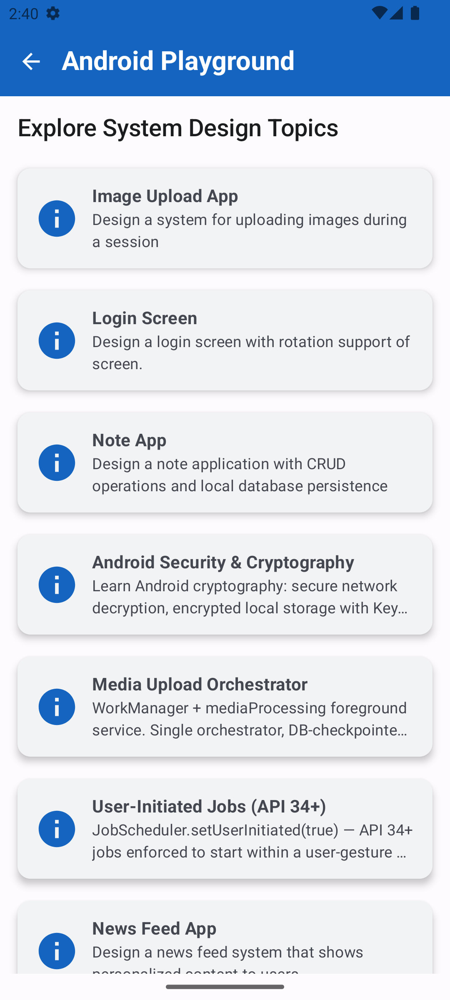 |

---

### 2. Image Upload
Multi-image upload with per-item progress tracking and success/failure status cards.

**MVI contracts:** `ImageUploadState` · `ImageUploadIntent` · `ImageUploadSideEffect`

| Image Upload Screen |
|:---:|
| 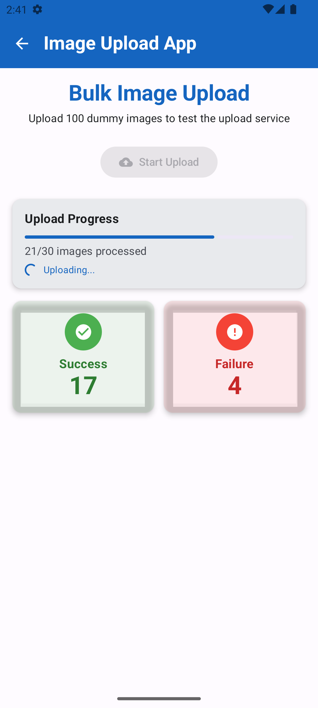 |

---

### 3. Login
Authentication screen with email/password form, input validation, visibility toggle, and loading/error states.

**MVI contracts:** `LoginState` · `LoginIntent` · `LoginSideEffect`

| Login Screen |
|:---:|
| 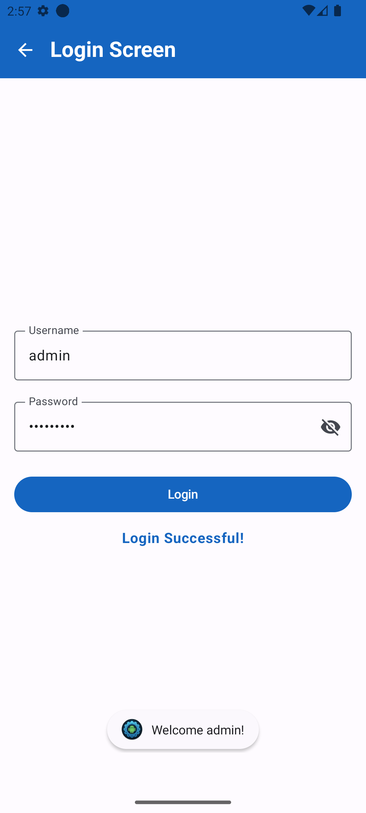 |

---

### 4. Note (Todo CRUD)
Full create/read/update/delete note app with search and Room-backed persistence.

**Screens:** Note List · Note Detail

**MVI contracts:** `NoteListState` · `NoteListIntent` · `NoteListSideEffect` · `NoteDetailState` · `NoteDetailIntent` · `NoteDetailSideEffect`

| Note List | Note Detail |
|:---:|:---:|
| 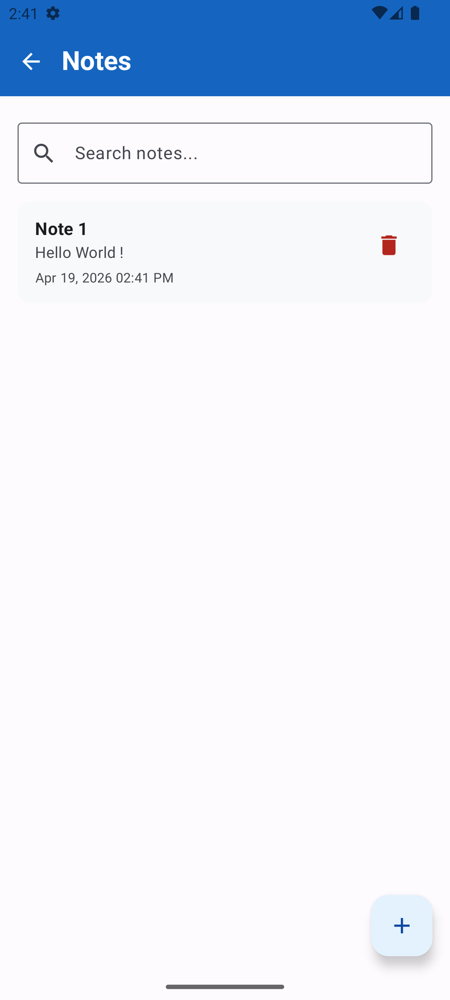 | 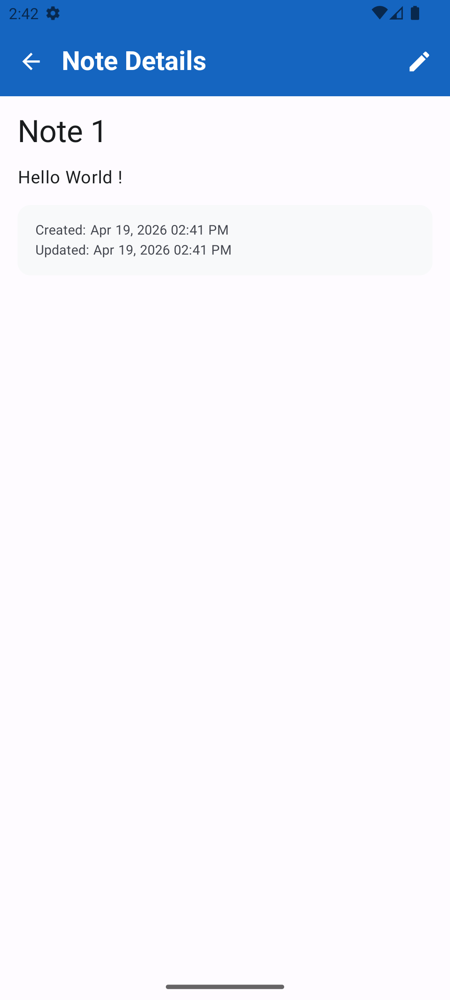 |

---

### 5. Crypto Security
Educational demos for Android security concepts: Android Keystore key management, Google Tink encryption, secure networking, and hybrid RSA-OAEP + AES-256-GCM payload encryption.

**Screens:** Home · Keystore Storage Demo · Tink Storage Demo · Secure Network Demo · Send Encrypted to Server

| Crypto Home | Keystore Demo | Tink Demo | Secure Network | Send Encrypted |
|:---:|:---:|:---:|:---:|:---:|
| 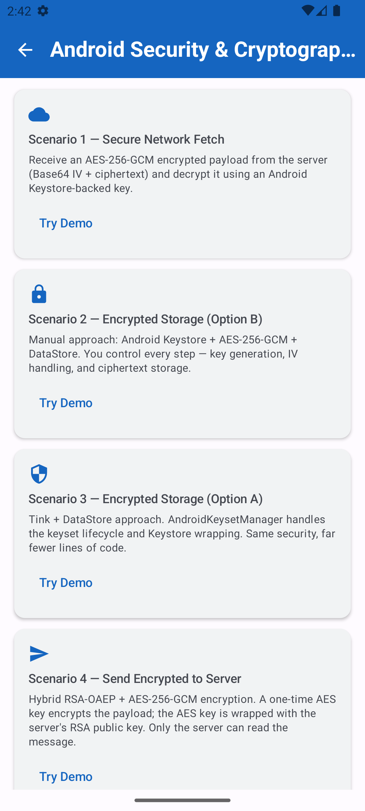 | 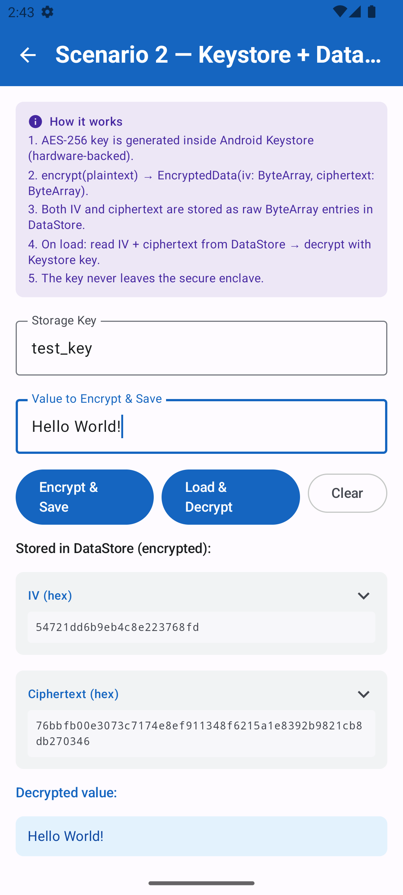 | 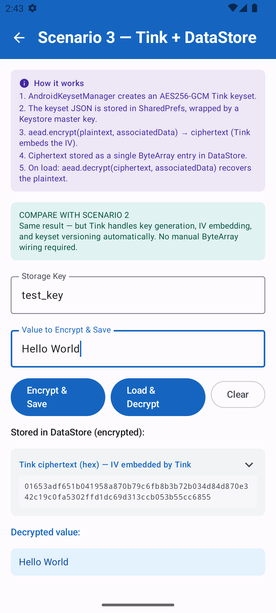 | 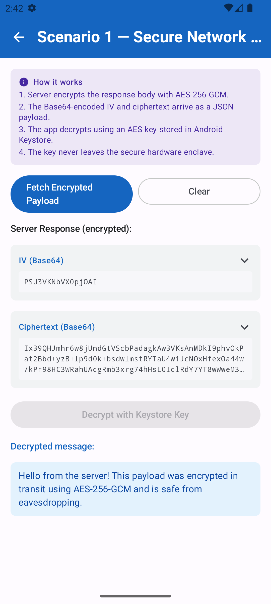 | 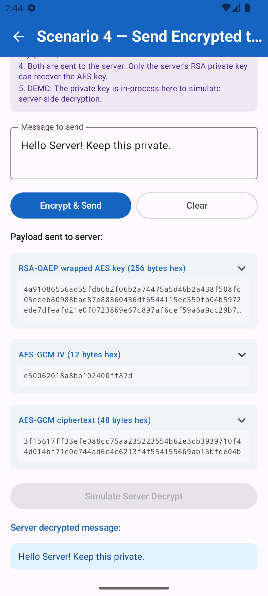 |

---

### 6. Media Orchestrator
WorkManager-based media processing pipeline. Add media items, enqueue an orchestrator worker, and observe per-item processing progress via Room.

**MVI contracts:** `MediaOrchestratorState` · `MediaOrchestratorIntent` · `MediaOrchestratorSideEffect`

| Media Orchestrator Screen |
|:---:|
| 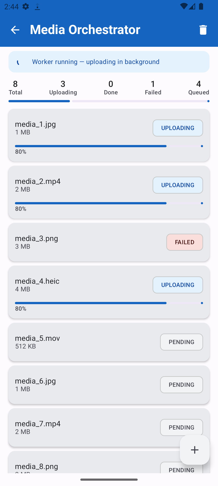 |

---

### 7. User-Initiated Service
Demonstrates long-running background transfers using both the legacy `JobScheduler` API and the modern `WorkManager` API, with a side-by-side comparison table.

**MVI contracts:** `UserInitiatedServiceState` · `UserInitiatedServiceIntent` · `UserInitiatedServiceSideEffect`

| User-Initiated Service Screen |
|:---:|
| 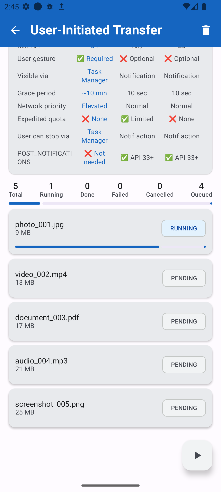 |

---
