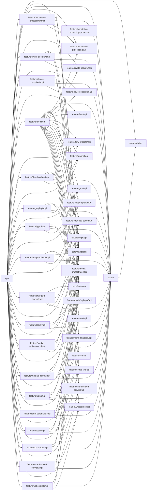

# Module Dependency Graph

_Auto-generated. Run `./gradlew generateModuleGraph` and commit the result to update._

```mermaid
graph LR
    app["app"]
    core_analytics["core/analytics"]
    core_common["core/common"]
    core_navigation["core/navigation"]
    core_ui["core/ui"]
    feature_annotation_processing_api["feature/annotation-processing/api"]
    feature_annotation_processing_impl["feature/annotation-processing/impl"]
    feature_annotation_processing_processor["feature/annotation-processing/processor"]
    feature_crypto_security_api["feature/crypto-security/api"]
    feature_crypto_security_impl["feature/crypto-security/impl"]
    feature_device_classifier_api["feature/device-classifier/api"]
    feature_device_classifier_impl["feature/device-classifier/impl"]
    feature_feed_api["feature/feed/api"]
    feature_feed_impl["feature/feed/impl"]
    feature_flow_livedata_api["feature/flow-livedata/api"]
    feature_flow_livedata_impl["feature/flow-livedata/impl"]
    feature_graphql_api["feature/graphql/api"]
    feature_graphql_impl["feature/graphql/impl"]
    feature_grpc_api["feature/grpc/api"]
    feature_grpc_impl["feature/grpc/impl"]
    feature_image_upload_api["feature/image-upload/api"]
    feature_image_upload_impl["feature/image-upload/impl"]
    feature_inter_app_comm_api["feature/inter-app-comm/api"]
    feature_inter_app_comm_impl["feature/inter-app-comm/impl"]
    feature_login_api["feature/login/api"]
    feature_login_impl["feature/login/impl"]
    feature_media_orchestrator_api["feature/media-orchestrator/api"]
    feature_media_orchestrator_impl["feature/media-orchestrator/impl"]
    feature_media3_player_api["feature/media3-player/api"]
    feature_media3_player_impl["feature/media3-player/impl"]
    feature_note_api["feature/note/api"]
    feature_note_impl["feature/note/impl"]
    feature_room_database_api["feature/room-database/api"]
    feature_room_database_impl["feature/room-database/impl"]
    feature_sse_api["feature/sse/api"]
    feature_sse_impl["feature/sse/impl"]
    feature_tic_tac_toe_api["feature/tic-tac-toe/api"]
    feature_tic_tac_toe_impl["feature/tic-tac-toe/impl"]
    feature_user_initiated_service_api["feature/user-initiated-service/api"]
    feature_user_initiated_service_impl["feature/user-initiated-service/impl"]
    feature_websocket_api["feature/websocket/api"]
    feature_websocket_impl["feature/websocket/impl"]

    app --> core_analytics
    app --> core_navigation
    app --> core_ui
    app --> feature_annotation_processing_api
    app --> feature_annotation_processing_impl
    app --> feature_crypto_security_api
    app --> feature_crypto_security_impl
    app --> feature_device_classifier_api
    app --> feature_device_classifier_impl
    app --> feature_feed_api
    app --> feature_feed_impl
    app --> feature_flow_livedata_api
    app --> feature_flow_livedata_impl
    app --> feature_graphql_api
    app --> feature_graphql_impl
    app --> feature_grpc_api
    app --> feature_grpc_impl
    app --> feature_image_upload_api
    app --> feature_image_upload_impl
    app --> feature_inter_app_comm_api
    app --> feature_inter_app_comm_impl
    app --> feature_login_api
    app --> feature_login_impl
    app --> feature_media_orchestrator_api
    app --> feature_media_orchestrator_impl
    app --> feature_media3_player_api
    app --> feature_media3_player_impl
    app --> feature_note_api
    app --> feature_note_impl
    app --> feature_room_database_api
    app --> feature_room_database_impl
    app --> feature_sse_api
    app --> feature_sse_impl
    app --> feature_tic_tac_toe_api
    app --> feature_tic_tac_toe_impl
    app --> feature_user_initiated_service_api
    app --> feature_user_initiated_service_impl
    app --> feature_websocket_api
    app --> feature_websocket_impl
    core_navigation --> core_ui
    core_ui --> core_analytics
    feature_annotation_processing_impl --> core_common
    feature_annotation_processing_impl --> core_navigation
    feature_annotation_processing_impl --> core_ui
    feature_annotation_processing_impl --> feature_annotation_processing_api
    feature_annotation_processing_impl --> feature_annotation_processing_processor
    feature_crypto_security_impl --> core_common
    feature_crypto_security_impl --> core_navigation
    feature_crypto_security_impl --> core_ui
    feature_crypto_security_impl --> feature_crypto_security_api
    feature_device_classifier_impl --> core_common
    feature_device_classifier_impl --> core_navigation
    feature_device_classifier_impl --> core_ui
    feature_device_classifier_impl --> feature_device_classifier_api
    feature_feed_impl --> core_common
    feature_feed_impl --> core_navigation
    feature_feed_impl --> core_ui
    feature_feed_impl --> feature_annotation_processing_api
    feature_feed_impl --> feature_crypto_security_api
    feature_feed_impl --> feature_device_classifier_api
    feature_feed_impl --> feature_feed_api
    feature_feed_impl --> feature_flow_livedata_api
    feature_feed_impl --> feature_graphql_api
    feature_feed_impl --> feature_grpc_api
    feature_feed_impl --> feature_image_upload_api
    feature_feed_impl --> feature_inter_app_comm_api
    feature_feed_impl --> feature_login_api
    feature_feed_impl --> feature_media_orchestrator_api
    feature_feed_impl --> feature_media3_player_api
    feature_feed_impl --> feature_note_api
    feature_feed_impl --> feature_room_database_api
    feature_feed_impl --> feature_sse_api
    feature_feed_impl --> feature_tic_tac_toe_api
    feature_feed_impl --> feature_user_initiated_service_api
    feature_feed_impl --> feature_websocket_api
    feature_flow_livedata_impl --> core_common
    feature_flow_livedata_impl --> core_navigation
    feature_flow_livedata_impl --> core_ui
    feature_flow_livedata_impl --> feature_flow_livedata_api
    feature_graphql_impl --> core_common
    feature_graphql_impl --> core_navigation
    feature_graphql_impl --> core_ui
    feature_graphql_impl --> feature_graphql_api
    feature_grpc_impl --> core_common
    feature_grpc_impl --> core_navigation
    feature_grpc_impl --> core_ui
    feature_grpc_impl --> feature_grpc_api
    feature_image_upload_impl --> core_common
    feature_image_upload_impl --> core_navigation
    feature_image_upload_impl --> core_ui
    feature_image_upload_impl --> feature_image_upload_api
    feature_inter_app_comm_impl --> core_common
    feature_inter_app_comm_impl --> core_navigation
    feature_inter_app_comm_impl --> core_ui
    feature_inter_app_comm_impl --> feature_inter_app_comm_api
    feature_login_impl --> core_common
    feature_login_impl --> core_navigation
    feature_login_impl --> core_ui
    feature_login_impl --> feature_login_api
    feature_media_orchestrator_impl --> core_common
    feature_media_orchestrator_impl --> core_navigation
    feature_media_orchestrator_impl --> core_ui
    feature_media_orchestrator_impl --> feature_media_orchestrator_api
    feature_media3_player_impl --> core_common
    feature_media3_player_impl --> core_navigation
    feature_media3_player_impl --> core_ui
    feature_media3_player_impl --> feature_media3_player_api
    feature_note_impl --> core_common
    feature_note_impl --> core_navigation
    feature_note_impl --> core_ui
    feature_note_impl --> feature_note_api
    feature_room_database_impl --> core_common
    feature_room_database_impl --> core_navigation
    feature_room_database_impl --> core_ui
    feature_room_database_impl --> feature_room_database_api
    feature_sse_impl --> core_common
    feature_sse_impl --> core_navigation
    feature_sse_impl --> core_ui
    feature_sse_impl --> feature_sse_api
    feature_tic_tac_toe_impl --> core_common
    feature_tic_tac_toe_impl --> core_navigation
    feature_tic_tac_toe_impl --> core_ui
    feature_tic_tac_toe_impl --> feature_tic_tac_toe_api
    feature_user_initiated_service_impl --> core_common
    feature_user_initiated_service_impl --> core_navigation
    feature_user_initiated_service_impl --> core_ui
    feature_user_initiated_service_impl --> feature_user_initiated_service_api
    feature_websocket_impl --> core_common
    feature_websocket_impl --> core_navigation
    feature_websocket_impl --> core_ui
    feature_websocket_impl --> feature_websocket_api
```
